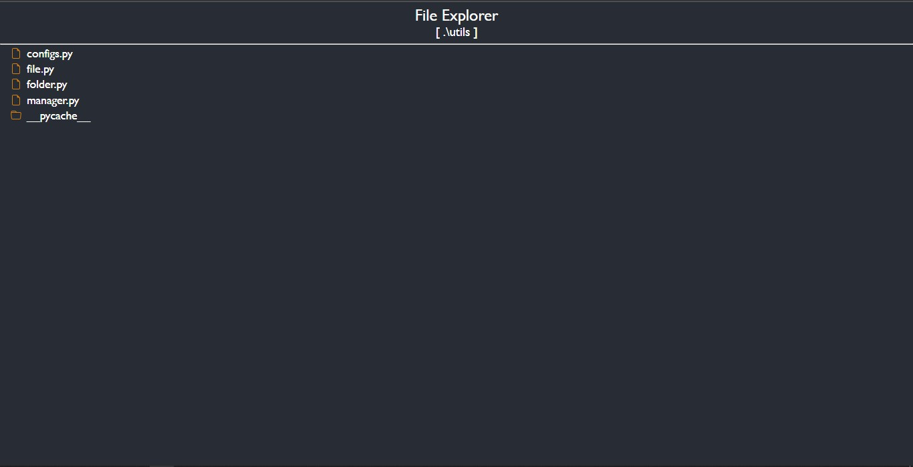

## File Explorer 
`python-flask`
* can serve all type of file
* Supported files
	* programming language files `with syntax highlighting`
	* Image : jpg, jpeg, png, svg
	* AV: mp3, mp4 `todo`
	* PDF : pdf
	* Office : word, excel `todo`

`Have a look`


### Run
* install requirements `pip install -r requirements.txt`
* then run to see usage,
```cmd
	python main.py --help
```

#### Used
* `highlight.js` for syntax highlighting & theme
* `python-flask` for backend
	* argparse - for handling commandline arguments
	* os - for file handling
	* threading - for parallel processing

### TODOs
* file buffering
* can see raw & parsed `md` file
* accessible to any device in a home network
* cache static files (css & js) ?
* file editable 